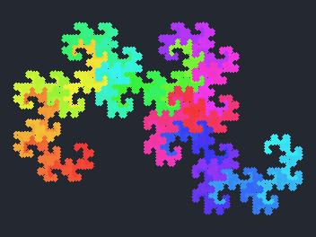
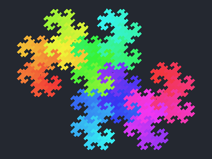
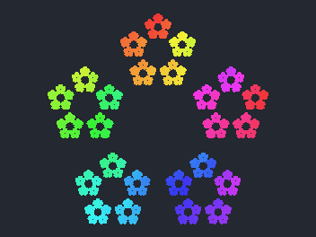
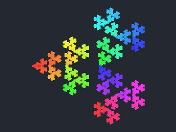
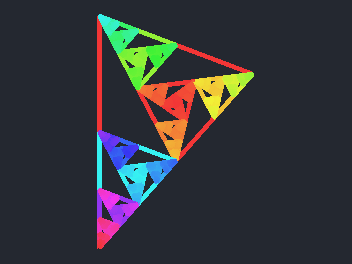
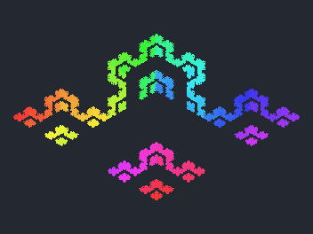
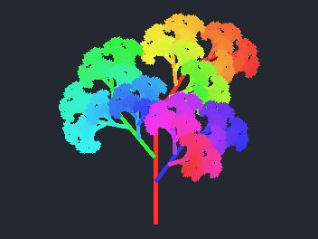
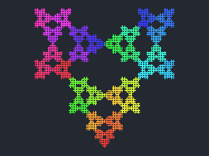
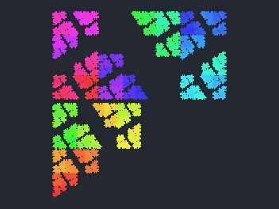

# Fractalium

**Seed** の折れ線と、相似変換（平行移動・回転・スケール）として表した **Replica** の一覧を組み合わせて、ブラウザやデスクトップから対話的に IFS 風のフラクタルをいじれるクライアントアプリです。**Depth** や **Replica** を変えると **Result** にすぐ反映されます。

https://halhorn.github.io/fractalium/

https://github.com/user-attachments/assets/72efb82c-006f-4da5-bf7b-f2ffbdc30293

---

## 試してみる（Web）

### フラクタルを選ぶ
https://halhorn.github.io/fractalium/ にアクセスすると表示するフラクタルを選ぶ画面になります。
まずはプリセットからフラクタルを表示してみましょう。

| **Preset** メニュー名 | **見本** | 概要 |
|----------------------|----------|------|
| Sierpiński triangle |  | 正三角形から中央の三角形を繰り返し取り除く古典的フラクタル。 |
| Koch curve |  | 線分に突起を足す操作を繰り返した雪の結晶に似た曲線。 |
| Vicsek (fractal cross) |  | 十字型に小さいコピーが並ぶ、自己相似な集合。 |
| Dragon curve |  | 折り紙の折り目の極限として知られる角ばった平面曲線。 |
| Lévy C curve |  | 直角二等辺三角形の斜辺を反復してできる曲線。 |
| Pythagoras tree |  | 直角三角形と正方形からなる、木の形の有名な図。 |
| Sierpiński hexagon |  | 正六角形に沿った穴あきパターン（六角版のシェルピンスキー系）。 |
| Sierpiński pentagram |  | 五角形／星形に関係した自己相似パターン。 |
| Terdragon curve |  | 3 本のドラゴン曲線が絡み合う形の、自己相似な曲線。 |
| hal Cyclone Triangle |  | 垂直な基線から 2 系の複製で回転の強い構造になる作者作の IFS。 |
| hal Wing |  | 水平な基線に 5 複製が置かれたひし形〜翼に近い作者作のパターン。 |
| hal Tree |  | 縦長の種から広がる樹枝状の作者作の IFS。 |
| hal V Star |  | 短い縦線と 3 複製でつくられる星・V に近い作者作の図形。 |
| hal Mosaic Window |  | hal V Star に近い基線から、異なる複製オフセットで窓・モザイク調になる作者作。 |

選ぶとそのフラクタルが表示されます。

別のフラクタルを選ぶ場合、「Open」ボタンを押すと別のフラクタルを選べます。「New Fractal」を押せば1から自分で作ることもできます。

別のフラクタルを選ぶと現在開いているものは消えてしまうので、必要に応じて「Share」から Link をコピーしておくとよいでしょう。

### 画面構成

大きく次の領域に分かれます。

| 領域 | 役割 |
|------|------|
| **Seed** | フラクタルの出発となる折れ線を描く・編集する |
| **Placement** | Seed のコピーである **Replica** を配置する。クリックして選び、ドラッグで移動・拡縮・回転する |
| **Result** | 再帰で生成されたフラクタルを表示。**Depth** スライダーと **Show generations** がある |
| **Parameters** | **Replica 0** 形式の見出しのもとで X/Y・**Rotation (deg)**・**Scale** などを数値編集する。（普段は下端もしくは右端に閉じている。） |
| **Control** | 戻る／進む、**Snap**、**Preset**、**Share** など |


### フラクタルを編集する

- **Depth**  
  **Result** 左上の **Depth** スライダー（右隣の数値）で再帰の段数を変えられます。上限は **Replica** の個数や **Show generations** の有無から自動で決まります。**Replica** が多いときに **Depth** を上げると描画負荷が急増しやすいです。
- **Replica**  
  **Placement** ヘッダの **+ Add** で追加します。**Placement** で枠を掴んで移動・拡縮・回転するか、**Parameters** の **Replica 0** といった見出しの下で X/Y・**Rotation (deg)**・**Scale** を調整します。削除は **Parameters** の **Delete this replica**、**Placement** 上の右クリック、または **-**（選択中の **Replica**）で行えます。
- **Seed**  
  **Seed** キャンバス上でドラッグして線分を描き、クリックで選んでからドラッグで線ごと移動・端点移動ができます。**Clear** で全線分を消し、**-** で選択中の 1 本だけ削除します。
- **Shape**  
  線分・正多角形・L 字などの定形を、現在の **Seed** 画面に追加するメニューです。入れ替えたいときは **Clear** してから選ぶとよいです。

### フラクタルの組み立てられ方

各 **Replica** は「いまの図形へ相似変換をかけたもの」を次の段の入力へ足し込みます。**Depth** を 1 ずつ上げると、その変換の木が一段深くなります。

**Show generations** をオンにすると、末端だけでなく**途中の世代の線分も残して描画**します。成長の様子を重ねて見たいときや、**Pythagoras tree** などで枝の広がりを追うのに向きます。オフのときは負荷を抑えつつ、先端付近が強調された見え方になります。

### もう少し踏み込んだ操作

- **スナップ**  
  バーの **Snap** は「常にグリッドスナップ相当」を Seed の描画に効かせます（内部では Ctrl キーと同じ経路に載せています）。**Shift** を押しながら描くと 45° きりの方向に制限します。Placement パネルでは **Ctrl** を押している間、移動・拡縮・回転に細かいグリッドやステップがかかります（[`placement/mod.rs`](src/ui/canvas/placement/mod.rs) 先頭のコメントに一覧があります）。
- **Parameters**  
  各 **Replica** ごとに折りたたみがあり、色は **Result** 上の **Replica** に対応しています。パネル全体を閉じたい場合は **◀** / **▶** や **Parameters** 見出しのトグルで畳めます。
- **共有**  
  **Share → Copy link** で状態を符号化した文字列をクリップボードへ入れます。**ブラウザ版**では現在のページを表す**完全な URL**（`?from=share` と `#` 以降の本文）になり、誰かがその URL を開くと同じ図形に戻ります。**ネイティブ版**ではウィンドウにアドレスバーがないため、`?from=share#…` 形式の**相対断片**がコピーされます。`https://halhorn.github.io/fractalium/` と連結して 1 本の URL にするか、ローカルの `trunk serve` のオリジンに貼り付けてください。**Download image** は結果ビューの PNG 出力です（メニューを開くとオフスクリーン取得が走ります）。

---

## ソースから触る（開発・ローカル実行）

リポジトリをビルドして UI をいじったり、モジュールの境界を追ったりする人向けです。画面の説明は上の「試してみる」節を参照してください。

### ネイティブ（Rust）

[`rustup`](https://rustup.rs/) で toolchain を入れてください。本リポジトリの `Cargo.toml` では **Rust 1.85 以上**を想定しています。

```bash
rustc --version   # 1.85.0 以降であること
```

```bash
git clone https://github.com/halhorn/fractalium.git
cd fractalium
cargo run
```

ビルド済みバイナリだけを配布する形ではないので、初回は依存 crates の取得とコンパイルに時間がかかります。PNG のファイル保存など、OS のダイアログを使う処理はデスクトップ版で利用できます。

### Web をローカルでビルドする場合

```bash
rustup target add wasm32-unknown-unknown
cargo install --locked trunk
trunk serve
```

`Trunk.toml` に従い、既定ではポート **`8080`**（`0.0.0.0` で待ち受け）です。ブラウザで `http://127.0.0.1:8080/` などを開いてください。

---

## 設計

モジュールごとに一文の説明を [`src/app/README.md`](src/app/README.md)、[`src/ui/README.md`](src/ui/README.md)、[`src/core/README.md`](src/core/README.md) などにまとめています。全体像だけここに抜粋します。

| レイヤ | 責務の要約 |
|--------|------------|
| [`core`](src/core/README.md) | Bevy に依存しない純データ・幾何・再帰予算・種プリセット用データ |
| [`app`](src/app/README.md) | セッション状態、Undo／プリセット適用・深さクランプ、共有ペイロード、エクスポートのオーケストレーション。ドメイン規則の入口 |
| [`ui`](src/ui/README.md) | egui によるパネル・レイアウト、各キャンバスの入力。`app` 経由で状態を更新し、プラットフォーム具象には直接触れない |
| [`ports`](src/ports/README.md) | 共有 URL・履歴・PNG 出口など、環境差し替え用の trait |
| [`platform`](src/platform/README.md) | `ports` のネイティブ／WASM 実装 |
| [`encoding`](src/encoding/README.md) | 共有 URL 用のフラットなキー／値表現（構文と符号化） |
| [`fractal_presets`](src/fractal_presets/README.md) | 全体プリセットの静的定義と一覧（適用手順と境界は `app`） |
| [`bootstrap`](src/bootstrap/README.md) | Bevy `App` の組み立て、プラグイン順、初期リソースと起動システム |

人間・AI 双方向けのリポジトリ共通指針は [`AGENTS.md`](AGENTS.md) を参照してください。

---

## ロードマップ・作業メモ

長期・MVP・Web 公開などの計画は [`planning/overall_plan.md`](planning/overall_plan.md)、[`planning/mvp/overall_plan.md`](planning/mvp/overall_plan.md)、[`planning/web_wasm/overall_plan.md`](planning/web_wasm/overall_plan.md) にあります。

---

## Web 版とネイティブ版の違い（参考）

| 項目 | 内容 |
|------|------|
| 配布 | Web は上記 URL から利用可能。ネイティブはローカルビルドまたは各自配布 |
| キーボード | Seed の Undo は **Ctrl+Z** / **Cmd+Z** の両系統に対応。外付けキーボードのない環境ではバーの **Snap** がグリッド描画の代用になりやすい |
| フォント | egui の既定フォント依存のため、OS ごとに字形がわずかに異なることがあります |
